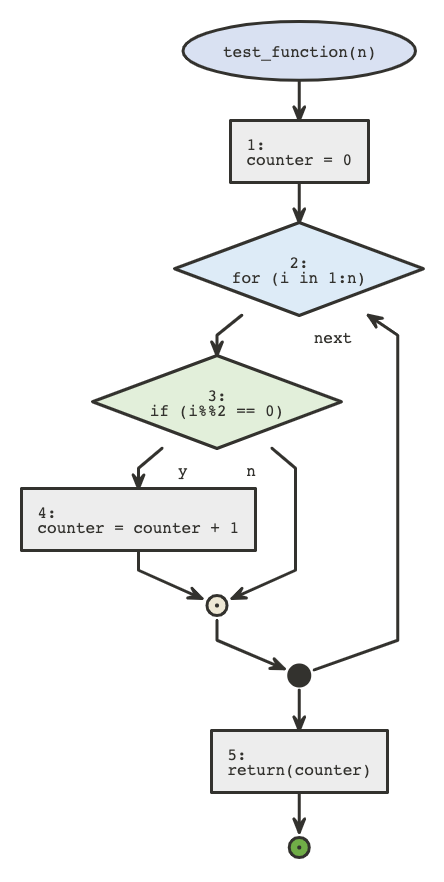
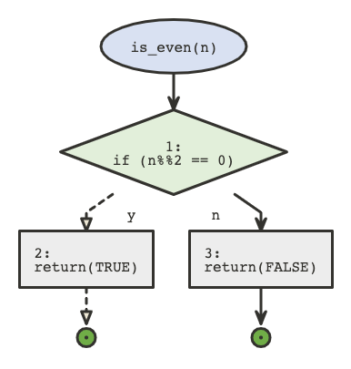

```{r setup, include=FALSE}
knitr::opts_chunk$set(echo = TRUE)

library(remotes)
#remotes::install_github("moodymudskipper/flow")
library(flexdashboard)
library(flow)
```

## Overview

The R package, *flow*, was created to help visualize what is going on in a script, function or expression. It creates a flow diagram, displaying each step of your function. This can help with debugging a complicated script or just understanding the logic of an algorithm. This package was created by Antoine Fabri (moodymudskipper on Github) and can be installed through github. He has also created other packages and is highly active on stackoverflow. *Flow* is still in its first version (0.0.1). 

### Package Imports

*Flow* is built on the nomnoml package and plantuml package. Nomnoml and plantuml are both UML diagram drawing packages.

Other imported packages: 

utf8       
cli         
vctrs       
pillar      
lifecycle   
tibble     
R.utils     
R.oo        
R.methodsS3 
ps          
processx    
callr      
xfun        
R.cache     
webshot     
styler      

---- 

## Usage
The main purpose of this package is to be used during debugging so we can better understand the logic behind built-in functions and the arguments it takes/how these arguments are used. *Flow* can also be used for functions that we create ourselves in order to ensure our functions are working the way that we want them to. For example, in our presentation, we wrote the function *test_function* which can be used as an argument within any of the flow methods. By doing so, we'd be able to see what our function does, and make any changes if we notice that our function isn't doing what we thought it would do. 

## Methods and Examples 

### Test function
For this presentation, we made our own function called *test_function* which returns the number of even numbers from 1 to a given number, n. We'll be using this function in the following examples to see how the flow functions works.

```{r}
test_function <- function(n){
  counter = 0
  for (i in 1:n){ #goes through numbers 1-n
    if( i %% 2 == 0){ #checks if the number is even
      counter = counter + 1  #increments the counter every time we get an even number
    }
  }
  return(counter) #returns the counter
}
```

### flow_view
The `flow_view()` method can be used on a function, a quoted expression, or the path of an R script in order to visualize it. In this case, we ran `flow_view()` on our function *test_function* to see the logic behind it. 
```{r}
flow_view(test_function)
```

### flow_run
The `flow_run()` function allows you to visualize what path is being taken when a certain function is being **called**. This is different from `flow_view()` in that it also gives you the output of the function. In this case, we tried running our function *test_function* on the number 5 with which the function accurately returns the number 2. This is because the only even numbers between 1 and 5 are 2 and 4. 

```{r, include = TRUE}
flow_run(test_function(5))
```


A better function we can use in order to show the functionality of this method would be this `is_even` function that we wrote because all it does is check whether or not an input is even. 
```{r, include = TRUE}
is_even <- function(n){
    if( n %% 2 == 0){ #checks if the number is even
      return (TRUE)
    }
    else{
      return (FALSE)
    }
}

flow_run(is_even(5))
```


From this flow diagram, we can see that with the input 5, the function goes down the return(FALSE) branch since 5 %% 2 does *not* equal 0. Consequently, it doesn't go down the return(TRUE), making this path dotted, as opposed to the solid arrow shown from if(n%%2 ==0) to return(FALSE).

### flow_data
The `flow_data()` function shows the edge and node data that's generated by `flow_view()`. In other words, it shows the types of methods that are used within the function, as well as how the function traverses down the flow chart created by the `flow_view()` function.
```{r}
flow_data(test_function)
```

----

## Similar Packages

There are several packages in R that allow the creation of flow charts, however their purpose is more for the visualization of an idea while the *flow* package is meant for visualization of how a function works for debugging by using a flow chart. Several functions built in R are tools that can be used for debugging code, but with no visual aspect. For example, `browser()` will open an environment that will allow the user to go through the code one line at a time while `debug()` is a function that will open the browser to track the problem within a specific function. Applying the information taken from these debugging functions into creating a flow chart may create a better understanding of the function 

### Other Packages for Creating Flow Charts {.tabset}

Both *diagram*, *diagrammeR*, and *Gmisc* are popular packages for producing simple flow charts in R.

#### diagram 

The *diagram* package has three main ways it can be used. First, the function `plotmat()` takes a matrix input consisting of transition coefficients or interaction strengths then plots a network of boxes connected with arrows that are labeled with the value of the coefficients. The function `plotweb()` also takes an input of a matrix and plots a web with arrows having a thickness corresponding with the value of the coefficient. Finally, simple flow charts can be made by creating separate objects and connecting them with arrows.

(Soetaert, 2009)

----

#### diagrammeR

The *diagrammeR* package is used exlcusively for modifying, anaylzying, and visualizing network graphs. Outputs can be created for R Markdown documents, Shiny web apps, and as image files. As it was created by using the *htmlwidgets* package, this package creates an easy framework from working from JavaScript to R. 

(Iannone, 2020)

----

#### Gmisc

The *Gmisc* package uses the built-in R package *grid* in order to create and personalize basic flow charts in order to visualize a process or working through an idea. Not only can regular expressions be formatted into the boxes, mathematical equations with special characters can also be written into boxes using the `bquote()` function.

(Gordon, 2020)

----

### Similarities and Differences

The table below displays the similarities and differences between *flow* and similiar packages and their capabilties of creating flow charts.

```{r, echo = FALSE}
mytable = data.frame(
    Package      = c("diagram", "diagrammeR", "Gmisc"),
    Similarities = c("* Inputs can be functions\ \n* Option for creating a longer chart", 
                     "* Works exclusively with flow charts\ \n* Analysis can be run from the output", 
                     "* Can change spacing between and alignment of boxes"),
    Differences  = c("* Can create different thickness of connecting arrows\ \n* If run with an error, function will create no output\ \n* Uses language from grid, which is more well-known",
                     "* Uses DOT language\ \n* Creates graphs from nodes and edges",
                     "* Uses R built-in package grid, which is has a language that is more well-known\ \n* Can code in special characters and symbols"))

pander::pander(mytable, keep.line.breaks = TRUE, style = 'grid', justify = 'left')


```

----

## Advantages and Disadvantages

### Advantages
- Helps with debugging
- Enables visualization when it comes to the logic flow of functions
- Can export the flow charts using a variety of different image file types (i.e. html, png, jpeg, pdf, etc.)

### Disadvantages
- Can't modify the aesthetics like you can in ggplot (colors, shapes, sizing, etc.)
- Gets complicated with some of the built in R functions since there's a lot of coding behind it (i.e. lm function)

```{r}
flow_view(lm)
```

```{r}
flow_view(mean)
```
----

## References

Fabri Antoine, *flow* from <https://github.com/moodymudskipper/flow>

Gordon Max, *Building a flowchart* from <https://cran.r-project.org/web/packages/Gmisc/vignettes/Grid-based_flowcharts.html#grid-some-background-info>

Iannone Richard, *DiagrammeR* from <https://github.com/rich-iannone/DiagrammeR>

Peng Roger D. , Kross Sean, and Anderson Brooke, *Mastering Software Development in R*, from <https://bookdown.org/rdpeng/RProgDA/>

Soetaert Karline, *R Package diagram: visualising simple graphs, flowcharts, and webs* from <https://cran.r-project.org/web/packages/diagram/vignettes/diagram.pdf>
